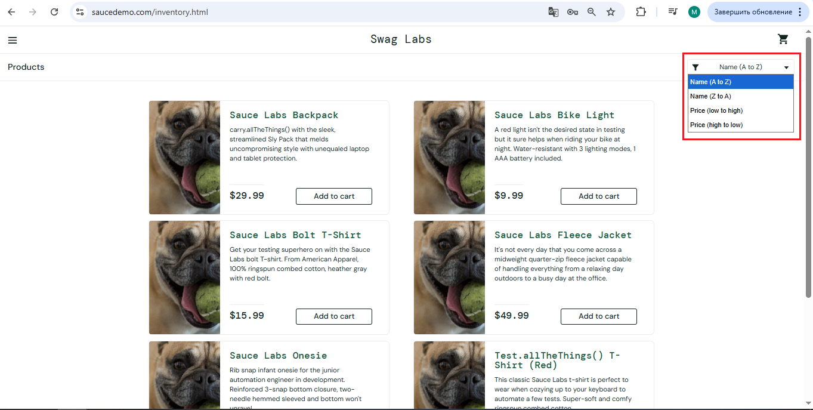

# Сортировка каталога не выполняется при выборе любого из 4 фильтров
## id 666

**Описание:** 
На главной странице есть возможность открытия списка фильтров по каталогу, но при выборе любого из 4 видов сортировки, не применяется ни один предлагаемый в списке.

**Окружение:** 
1. ОС: Windows 10 pro 22h2 19045.6456
2. Браузер: Chrome Версия: 147.0.7727.117
3. Сайт: [Swag Labs](saucedemo.com)
4. Версия сайта: Production

**Тестовые данные:** 
- Логин: problem_user 
- Пароль: secret_sauce

**Предусловие:** 
1. Открыть браузер
2. Перейти на сайт [Swag Labs](saucedemo.com)
3. Успешно авторизоваться в системе с тестовыми данными

**Шаги:**
1. Справа вверху под иконкой корзины нажать на значок фильтрации
2. В выпадающем меню поочередно выбрать пункты:
- "Name (A to Z)"
- "Name (Z to А)"
- "Price (low to high)"
- "Price (high to low)"
3. После выбора каждого вида сортировки, проверить применился ли фильтр на странице

**Фактический результат:** 
- В выпадающем меню фильтрации, при выборе любого из фильтров, список остается в том же виде, что и при фильтрации по умолчанию, Фильтр не применяется

**Ожидаемый результат:**
Каждый выбранный фильтр должен менять порядок товаров на странице:
- "Name (A to Z)" сортирует товары по имени по порядку от A до Z;
- "Name (Z to А)" сортирует товары по имени в обратном порядке от Z до A;
- "Price (low to high)" сортирует товары по цене от меньшей к большей;
- "Price (high to low)" сортирует товары по от большей к меньшей;

**Приоритет:** *Medium*

**Серьезность:** *Major*

**Дополнительные материалы:**

